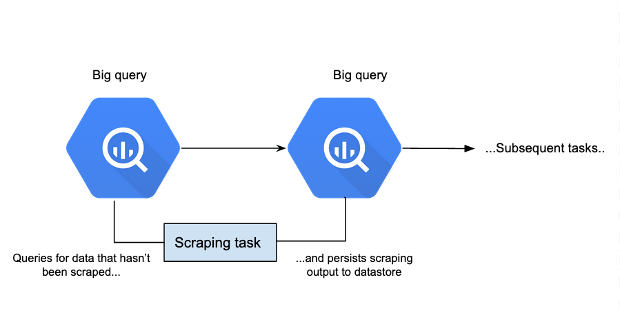

## Scrapping workflow phase 1 design 

**General requirements**
* Workflow can support multiple sources/multiple scraping strategies
* Workflow can be scaled easily
* Workflow is observable

**What currently exists**
* From [this Design Doc](https://www.notion.so/de8ece87473b4f37a0ea037d607d910a?v=1bec41f87a6b42acb639d348d2282195&p=6d6b1797931e465d9cf6f5d4641c911e), Angostura can be used to publish and persist data to google BigQuery.
* Sambil has been packaging their code as a library: c4v-py (this repo), which can be imported and used elsewhere.

**Proposed design** 

_Goal_: Leverage existing angostura infrastructure as much as possible

1. We upload the training data to big query.
    - Can be done in different ways. Easiest seems to be to upload the excel to google sheets, and import it into bigquery from there.
    - [This link](https://cloud.google.com/blog/products/gcp/how-to-crunch-your-business-data-from-sheets-in-bigquery) seems to describe a process to do just that.

2. A task defined in airflow queries for yet-to-be-enriched data and proceeds to scrape.
It can then persists the output to the table that classification workflow(s) will start from. 
   
    More on this job below. 

* Any further tasks such as cleaning and classification can be done further along the pipeline.

**Scraping task** 

* Here, we can leverage the python_transform job type Angostura offers. (which is backed by the BigQueryPythonOperator). From the Angostura documentation:
> The python_transform job takes a list of SQL files as arguments, a python function as a string and writes the result of calling that function with the arguments into a target BIgQuery table [...] Each transformation function is a Python function that receives pandas data frames as arguments.

* This means we could write a python module which     
    * Exposes one function, which takes a data frame as input and produces a data frame as output.
    * The input consists of the rows of data that need scraping. 
    * The output can be the same rows, with the scraped data now present in the columns where it should be so that they can be persisted.
    
_Then the job becomes_
1. Query for all the rows of data that haven’t been scrapped yet. 
   * As a simple example, if there is a nullable field called scraped_data in the persisted data, then the query can simply be select * where scraped_data is null
   * The query can also be modified to select only rows that contain a specific source, and pass those to a specific scraping task etc. That should make it flexible enough for anything we want to do in phase 2.

2. The python function exposed by the module is called with these rows passed in.
3. Scraping happens.
4. Scraping output is persisted.
 
**The python module** 

This can be very simple for the MVP. 
A sample design can simply be to:
* Define a scraper interface, which takes in a URL (+ anything else needed) and outputs scraped data.
* Implement a top level method, which contains a map of URL domains to scraper implementations
* Output is written to data frame

This is modularised, and lets us write specific scrapers for specific sources easily and independently of each other. We can only start with a few scrapers for specific, high-priority data sources.

**Picking the first source to write a scraper for**

From the excel [_TODO: add link_] that was provided by the partner NGO, we've worked out that the following distribution of sources:

This suggests that we should start writing a scraper for [El Pitazo](https://elpitazo.net/) first. 

Of course, we should confirm with the _servicios publicos_ team what they and the ngo see as the highest priority sources. 

